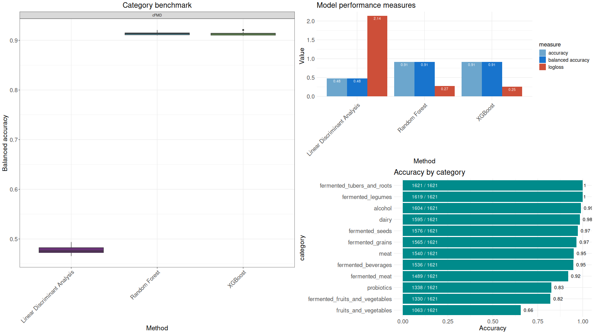

# Harnessing Machine Learning  
# for Predictive Tools in Microbiome Studies
A focus on amplicon sequence variants and metagenomic shotgun sequencing

## Authors and Contributors
[AIT Austrian Institute of Technology, Center for Health & Bioresources](https://www.ait.ac.at/en/research-topics/bioresources)

- Livio Antonielli
- Carolina Escobar Rodríguez*
- Tanja Kostić
- Angela Sessitsch

    *Current affiliation: FH Campus Wien University of Applied Sciences, Department of Bioengineering, Vienna, Austria. 

[Department of Cellular, Computational and Integrative Biology, University of Trento](http://segatalab.cibio.unitn.it/)

- Niccolò Carlino 
- Nicola Segata

## Abstract
The advent of machine learning has revolutionized the analysis of microbial community sequencing data derived from both amplicon and shotgun metagenomic sequencing. Traditional statistical analysis of microbial data has long favored tree-based algorithms, adept at handling the compositional, sparse, and high-dimensional nature of microbial data, despite the relatively low number of samples. Other algorithms have also proven to be suitable for analyzing such complex data. The rise of deep learning in various scientific fields, coupled with the proliferation of tools based on artificial neural networks, has opened new opportunities for exploration.

One recent [study](https://doi.org/10.1094/PBIOMES-08-22-0054-MF) aimed to elucidate the contributions of both the soil environment and the endophytic bacterial seed microbiota to the diversity and composition of adult *Setaria viridis* plants, a model for improving agronomic crops such as C4 grasses. Seeds of *S. viridis* from two separate locations in Austria, B5 and L9, were used. Seedlings grown on sterile agar plates were planted in either their native soil or the other non-native soil, resulting in four seedling-soil combinations. The bacterial communities of soils, maternal seeds, and the rhizospheres and endospheres of roots, stems, and panicles of the resulting plants were analyzed by amplifying and sequencing the V5-V7 region of the 16S rRNA gene. Machine learning algorithms can generate predictive tools based on Amplicon Sequence Variants (ASVs) to support the hypothesis that endospheres of plants grown in foreign soil will harbor communities that shift toward those of the soil while preserving some transmitted seedborne taxa.

In another development, the [cFMD](https://github.com/SegataLab/cFMD) database - curatedFoodMetagenomicData, a product of the EU H2020 [MASTER](https://www.master-h2020.eu/) project, offers an unprecedented resource for training models and benchmarking machine learning algorithms on large metagenomic data. The database comprises curated metadata and microbial taxonomic profiles of 2,533 metagenomes associated with 59 datasets, including 45 datasets and 583 samples from publicly available studies, and 14 datasets and 1,950 samples produced by MASTER partners.

These methodologies show the potential of using microbial variables to develop predictive tools in environmental, agricultural, and food studies, offering new possibilities at the intersection of data sciences and microbiome-based precision approaches.

## Table of Contents
- [Rationale](#rationale)
- [Introduction](#introduction)
- [First case study](#first-case-study)
- [Second case study](#second-case-study)
- [Running the code](#run-the-code)
- [Acknowledgements](#acknowledgements)
- [Citations](#citations)

## Rationale
The code provided in this repository is designed to reproduce the data presented during my talk at the *Data sciences and microbiome-based precision approaches* session, at the [miCROPe 2024](https://www.micrope.org/) conference.

The repository contains two primary case studies, each represented by an Rmd file:

1. The first case study focuses on Amplicon Sequence Variants (ASVs) and utilizes a custom dataset, including an ASV table and related metadata.

2. The second case study analyzes taxonomic profiles obtained from shotgun metagenomic data and available in the [cFMD](https://github.com/SegataLab/cFMD) database.

## Introduction
The application of machine learning to human microbiome research has been established for several years, yielding remarkable achievements across various domains. More recently, the use of machine learning for analyzing microbial data has expanded into fields such as soil and agricultural research, environmental studies, and the food industry. When focusing on the application of machine learning to metabarcoding and metagenomic data, regardless of origin, there is a predominant use of tree-based algorithms, such as Random Forest. These algorithms are highly effective for handling sparse, compositional data, which is characterized by a large number of variables relative to the number of samples. However, is this always the optimal approach? In this repository, we explore two case studies applying various algorithms and measures: the first focuses on amplicon sequencing variants, and the second on shotgun metagenomic sequencing. As illustrated in *Figure 1*, various families of algorithms were considered in the analyses.


<p align="center"><i>Figure 1: Tree map of all algorithms considered in the analyses, arranged in families.</i></p>

## First case study
This case study investigates microbial community assembly in Setaria viridis, a model organism for C4 grass plants. The objective was to explore how microbial communities in different plant compartments are influenced by the seed origin and the target cultivation soil. Seeds and soils were collected from two distinct locations in Austria: B5, characterized by sandy soil, and L9, characterized by clay soil. The seeds were sown in both their native soils (native samples) and foreign soils (foreign samples). The V5-V7 hypervariable region of the 16S rRNA gene was amplified and sequenced from samples including endophytic bacteria from various plant parts (panicle, stem, and root), original seeds, bulk soil, and rhizosphere. Amplicon Sequence Variants (ASVs) were generated using [DADA2](https://www.bioconductor.org/packages/release/bioc/html/dada2.html). Multiple rarefactions were applied to account for varying read numbers across samples. Data were then divided into native and foreign sample groups. Feature selection was used to remove ASVs with zero or nearly zero variance and to group perfectly correlated or anti-correlated ASVs, which helps reduce noise and redundancy. Finally, two sets of models were developed: one set assumed the seeds as the source for classifying plant compartments, while the other set assumed the soil as the source for identifying the origin of the microbes in the plant compartments.

## Second case study
This case study focuses on predicting food categories, types, and subtypes from taxonomic profiles available from the [cFMD](https://github.com/SegataLab/cFMD) (curated Food Metagenomic Data) database. The [cFMD](https://github.com/SegataLab/cFMD) was developed as part of the [MASTER](https://www.master-h2020.eu/) EU Horizon 2020 project, which concluded in 2023. The purpose of the [cFMD](https://github.com/SegataLab/cFMD) repository is to provide a centralized source of high-quality, curated microbiome data and metadata related to food. It includes approximately 2,500 food metagenomic samples, with over 500 samples sourced from publicly available data in NCBI and the remainder generated within the MASTER project. The data were utilized to generate metagenome-assembled genomes (MAGs) and to perform taxonomic profiling at both species and strain levels using [MetaPhlAn 4](https://github.com/biobakery/MetaPhlAn) and [StrainPhlAn 4](https://github.com/biobakery/biobakery/wiki/strainphlan4). As an example, *Figure 2* displays the performance of various machine learning methods, including LDA, Random Forest, and XGBoost, in predicting food categories from the [cFMD](https://github.com/SegataLab/cFMD) database. The left panel shows the balanced accuracy of each method using 10-fold outer resampling. The right panel provides the performance of the base learners across several metrics and a detailed breakdown for XGBoost across different food categories.



<p align="center"><i>Figure 2: Benchmark of base learners based on an 80% split chosen for training.</i></p>

## Running the code
The Rmd files for the first and second case studies are designed to be run within RStudio. These files include code chunks and instructions to facilitate the installation of all necessary packages and execution of all steps.

To clone the repository, use the following command:

  ```bash
  #git command
  git clone https://github.com/iLivius/miCROPe2024.git
  ```

Once the repository is cloned, you can find the Rmd scripts in the `scripts/` directory. Specifically:

 - `scripts/miCROPe2024_Setaria.Rmd`: The RMarkdown file for the first case study, focusing on Amplicon Sequence Variants (ASVs).
  - `scripts/miCROPe2024_cFMD.Rmd`: The RMarkdown file for the second case study, focusing on shotgun metagenomic data analysis.

*NOTE: The scripts assume that the repository is located in the user's home directory (e.g. ~/miCROPe2024). If you have cloned the repository to a different location, you will need to adjust the path settings in each Rmd file accordingly.*

## Acknowledgements
This work was supported by the [Austrian Science Fund (FWF)](https://www.fwf.ac.at/en/) (grant number P-26203) and by [MASTER](https://www.master-h2020.eu/) (Microbiome Applications for Sustainable food systems through Technologies and Enterprise) (EU Horizon 2020 research and innovation programme, grant agreement No 818368).

## Citations
- Escobar Rodríguez, C., Antonielli, L., Mitter, B., & Sessitsch, A. (2024). Assembly of Endophytic Communities of *Setaria viridis* Plants when Grown in Different Soils and Derived from Different Seeds. Phytobiomes Journal 2024 8:1, 34-45. https://doi.org/10.1094/PBIOMES-08-22-0054-MF

- Carlino, N., et al. (2024). Unexplored microbial diversity from 2,500 food metagenomes and links with the human microbiome. *In press*.
